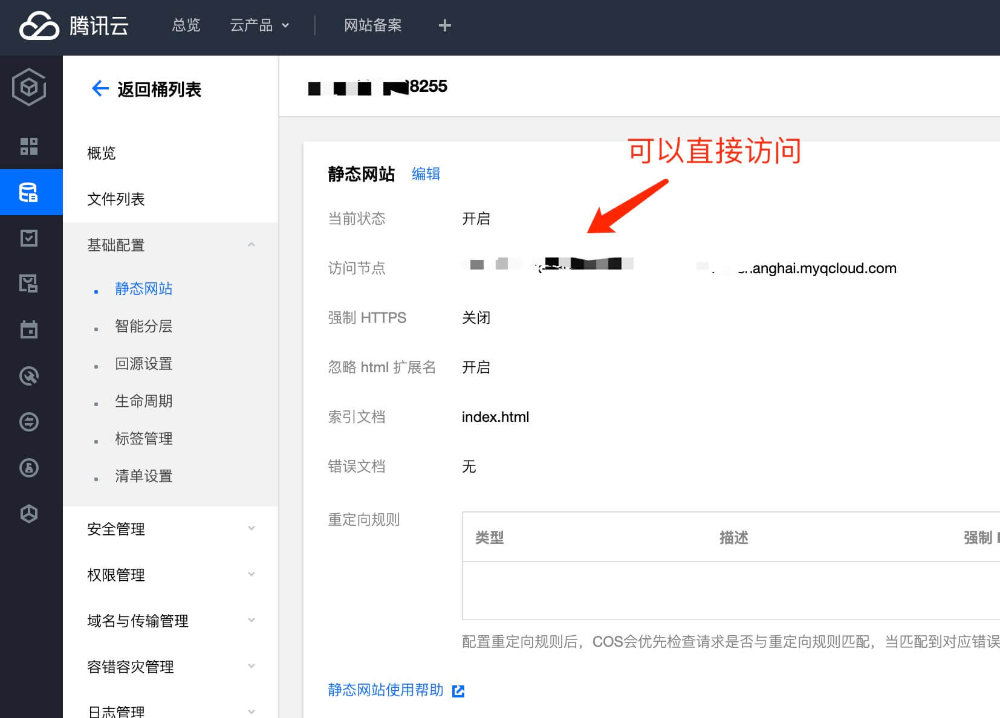
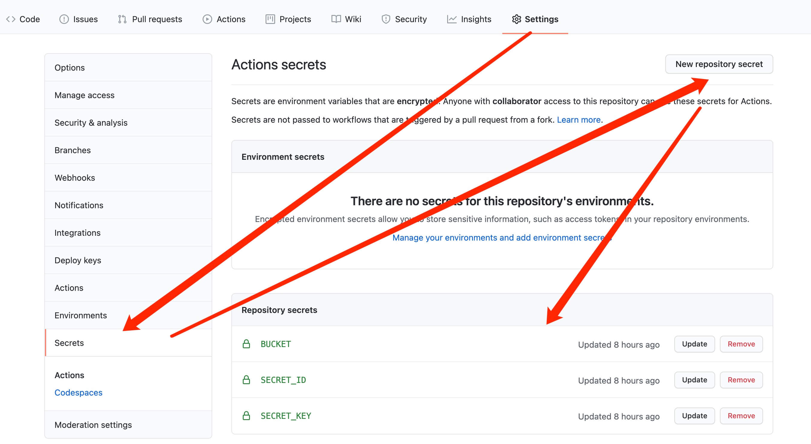

## 项目介绍

> 本博客是用[`docusaurus`](https://v2.docusaurus.io)为框架进行搭建的，docusaurus 框架由 facebook 团队出品，适合偏爱`Typescript`和`React`技术栈的程序员

由于这个框架可以生成静态文件进行部署，所以我这里采用的是腾讯云的 COS 存储（主要是因为便宜），你也可以使用阿里云的 OSS 对象存储。这两种存储配合使用 cdn 加速都可以达到不错的访问体验，费用也很低。

## 腾讯云 COS 配置

> 当然前提是你需要注册腾讯云的账户

[首次使用腾讯云的用户可以购买 1 核 2G 的服务器，作为练手项目完全够了。费用 1 年 95 元，3 年 288 元。建议直接买 3 年(我之前在阿里云只能 99 买 1 年，后期续费成本实在太高了)。](https://cloud.tencent.com/act/cps/redirect?redirect=10488&cps_key=6c82578c7c0898102fadd655edc3106b&from=activity)

### 开通腾讯云 COS 配置

关于开通可以直接参考[官方文档](https://cloud.tencent.com/document/product/436/14106)

注意： 访问权限需要设置为`公有读私有写`(任何人都可以访问，但只能你自己改)

### 开通静态站点



这里的地址就可以直接访问了。（你可以上传一个静态文件进行测试）

如果你想使用自己买的域名作为访问地址，那么可以购买域名的地方配置**DNS 解析**，解析选择 CNAME 进行地址映射。

### 关于 cdn

cdn 可以极大的提升用户的访问速度，并且对于个人小博客项目来说花费也不高。因此，这里我也配置了 cdn 进行加速


注意：cdn 配置的时候要选择之前配置的静态站点。

## GitHub 项目配置

### GitHub Actions

想要实现自动化部署，我们这里采用 github 提供的比较成熟的解决方案———— [`GitHub Actions`](https://github.com/features/actions)，主要原理就是在推送分支修改的时候，自动触发钩子事件，然后 Github 提供的 runners 就会执行你配置的指令操作。

我们这里就是利用推送到主分支的这个事件，来触发`yarn && yarn build`自动安装依赖并打包，最终把构建的 build 产物推送到腾讯云 COS 存储空间上。

### GitHub 配置

想要触发 GitHub Actions，首先我们要在项目的根目录位置添加配置文件，项目路径为

```
|-- .github
    |-- workflows
       |-- node.yml

```

其中 `node.yml`文件名是可以自己改变的，这里我使用`node`命名是因为打包需要使用 node 环境

具体的内容如下

```yaml
name: CI

on:
  push:
    branches:
      - { 你的分支 }

jobs:
  build:
    runs-on: ubuntu-latest

    steps:
      - name: Checkout {你的分支}
        uses: actions/checkout@v2
        with:
          ref: { 你的分支 }

      - name: Setup node
        uses: actions/setup-node@v1
        with:
          node-version: '12.x'

      - name: Build project
        run: yarn && yarn build

      - name: Upload COS
        uses: zkqiang/tencent-cos-action@v0.1.0
        with:
          args: upload -rs --delete -y ./build/ /
          secret_id: ${{ secrets.SECRET_ID }}
          secret_key: ${{ secrets.SECRET_KEY }}
          bucket: ${{ secrets.BUCKET }}
          region: ap-shanghai
```

你需要把{你的分支}替换为你希望触发自动打包的分支。

需要特别关注的地方在于最后一个 steps， with 里面配置的是腾讯云 COS 里面的鉴权相关的配置。

`${{ secrete.XXX }}` 是引用的在 github 中配置的环境变量
使用下面的方式进行配置


with 中执行的其实都是[COSCMD 工具](https://cloud.tencent.com/document/product/436/10976)的命令， `COSCMD`是腾讯云 COS 上传的工具。

#### 参数含义如下

| 参数       | 备注                                                                                                                                                                                                                                                         |
| ---------- | ------------------------------------------------------------------------------------------------------------------------------------------------------------------------------------------------------------------------------------------------------------ |
| args       | args 的参数是`COSCMD`中执行的 shell 脚本。`upload -rs --delete -y ./build/ /` 命令的作用是静默同步 build 目录与 COS 远程根目录。这使得 COS 根目录的文件内容和结构与 build 中的内容和结构经过此命令后会保持一致，对于之前相同的内容会进行缓存，不会重复上传。 |
| secret_id  | 从 [控制台-API 密钥管理](https://console.cloud.tencent.com/cam/capi) 获取                                                                                                                                                                                    |
| secret_key | 同上                                                                                                                                                                                                                                                         |
| bucket     | 对象存储桶的名称，包含后边的数字                                                                                                                                                                                                                             |
| region     | 对象存储桶的地区，[参见文档](https://cloud.tencent.com/document/product/436/6224)                                                                                                                                                                            |

:::info 提示 The directory does not exist
如果首次执行报错提示`The directory does not exist`(文件目录不存在的话)，可以先通过腾讯云的后台上传一个文件，再重新执行 GitHub Actions 就可以了。

:::
最终，以我的项目为例：

1. 我在*main*主分支上提交了新的代码
2. GitHub Actions 就会执行`yarn && yarn build`生成临时`build`文件夹
3. GitHub Actions 通过 zkqiang/tencent-cos-action@v0.1.0 执行删除和上传命令
4. 腾讯云 COS 更新资源
5. 腾讯云资源对应的域名获得自动更新

最终，整个项目实现了`DevOps`的流程！
